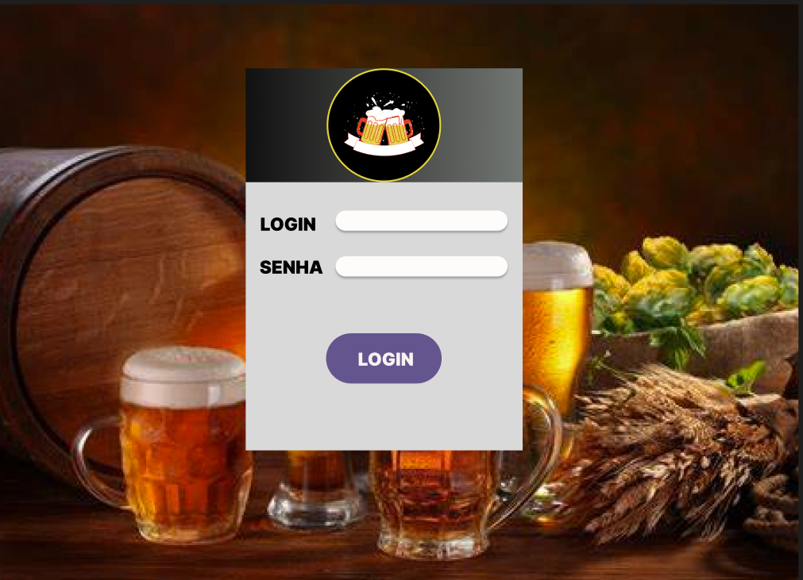
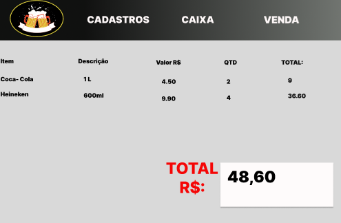

# Projeto Conveniência

## Descrição

Este projeto tem como objetivo desenvolver um sistema de conveniência/mercearia com funcionalidades essenciais para gestão de estoque, registro de vendas e compras, e interface amigável.

## Links Importantes

- **Protótipo no Figma**: <a href="https://www.figma.com/design/Ven0ZR5NmudWVrlGzw1Bl9/Untitled?node-id=0-1&node-type=canvas&t=3NFrSKUNbJMguJ8u-" target="_blank">Visualizar Protótipo</a>
  
- **Reunião com o Cliente**: <a href="https://senacmsedu-my.sharepoint.com/:w:/r/personal/matheus54098006_aluno_ms_senac_br/_layouts/15/Doc.aspx?sourcedoc=%7B76DE2164-1EF4-4AFC-ABD5-5ED447C58771%7D&file=Document3.docx&fromShare=true&action=default&mobileredirect=true" target="_blank">Acessar Documentação</a>

- **Hackplan**: <a href="https://app.hacknplan.com/p/208361/kanban?categoryId=0&boardId=575708" target="_blank">Visualizar Hackplan</a>

## Imagens do Protótipo

- **Tela de Login**:
  

- **Tela de Venda**:
  

## Votação para Framework

Por favor, vote no framework que você prefere para o desenvolvimento do projeto, respondendo a esta mensagem ou utilizando o canal designado:

- TkINTER
- PySide6
- Outro (especificar)

## Desenvolvedores

- <a href="https://github.com/samuelserri" target="_blank">Jonata (Samuel)</a>
- <a href="https://github.com/LuizzOliveira" target="_blank">Luiz</a>
- <a href="https://github.com/matheusin3031" target="_blank">Matheus</a>
- <a href="https://github.com/rodrigo570282" target="_blank">Rodrigo</a>
- <a href="https://github.com/Xavier-sa" target="_blank">Xavier (Wellington)</a>
